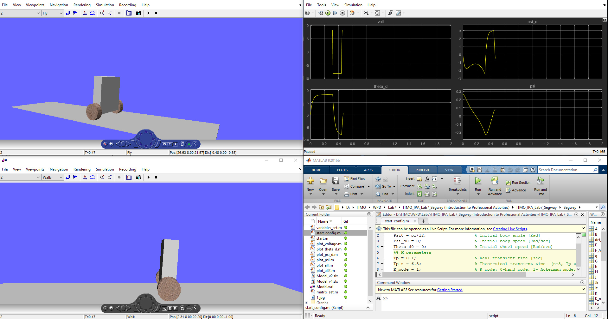

# ITMO_IPA_Lab7_Segway
  Introduction to Professional Activities. Segway robot model
***

Matlab / Simulink model of a Segway robot for laboratory work.
=============================
Script List:
------------
Skript  | Action
------------- | -------------
[start.m](Segway/start.m)  | Prepare variables for the model
[start_config.m](Segway/start_config.m)  | Setting the state of operation and controller
[variables_set.m](Segway/variables_set.m)  | Parameters of the robot
[matrix_set.m](Segway/matrix_set.m)  | Calculation of coefficients.
plot _ **.m  | graph ** (after modeling)
[plot_all2.m](Segway/plot_all2.m)  | all graphs (after modeling)
------------
Model List:
------------
Model  | Action
------------- | -------------
[Model_v1.slx](Segway/Model_v1.slx)  | Model without visualisation
[Model_v2.slx](Segway/Model_v2.slx)  | Model with visualisation
---------
Video:
------------
[Link to video "ITMO Robot Segway model (Introduction to Professional Activities)"](https://www.youtube.com/watch?v=slTVVhuOB-c)
